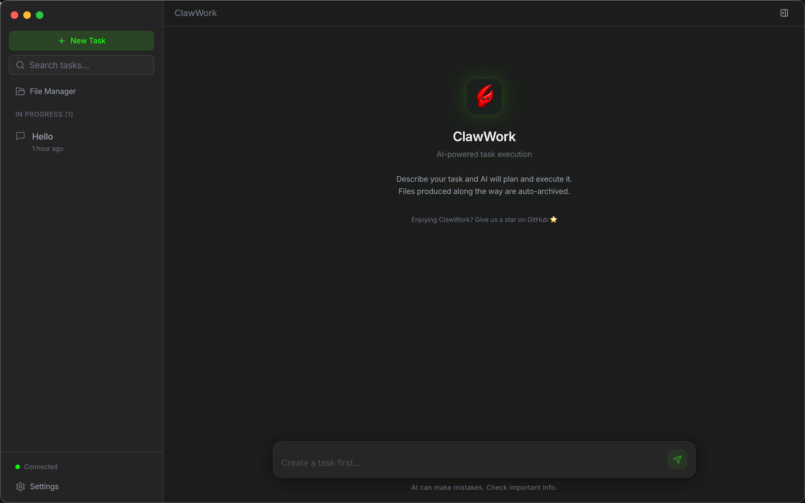

# ClawWork

A desktop client for [OpenClaw](https://github.com/openclaw/openclaw) — three-column layout, multi-task parallel execution, structured progress tracking, and local file management with Git versioning.



## Features

- **Three-column layout** — Task list, conversation, and progress/artifacts panel
- **Multi-task parallel** — Run multiple AI tasks simultaneously with isolated sessions
- **Structured progress** — Real-time tool call visualization and step tracking
- **Local-first artifacts** — AI outputs auto-saved to a local Git repo, searchable and versioned
- **Full-text search** — SQLite FTS5 across tasks, messages, and files
- **Dark / Light theme** — CSS variable driven, switchable at runtime

## Prerequisites

- [Node.js](https://nodejs.org/) >= 20
- [pnpm](https://pnpm.io/) >= 9
- A running [OpenClaw](https://github.com/openclaw/openclaw) server (Gateway on port 18789)

## Quick Start

```bash
# Install dependencies
pnpm install

# Start in development mode
pnpm --filter @clawwork/desktop dev
```

Configure the Gateway address and token in **Settings** (bottom-left gear icon), or set the environment variable:

```bash
OPENCLAW_GATEWAY_TOKEN=<your-token> pnpm dev
```

## Install with Homebrew

```bash
brew tap clawwork-ai/clawwork
brew install --cask clawwork
```

## Build

```bash
# macOS (arm64)
pnpm --filter @clawwork/desktop build:mac:arm64

# macOS (x64)
pnpm --filter @clawwork/desktop build:mac:x64

# macOS (Universal Binary)
pnpm --filter @clawwork/desktop build:mac:universal

# Windows
pnpm --filter @clawwork/desktop build:win
```

Output: `packages/desktop/dist/ClawWork-<version>-<arch>.dmg`

> The DMG is unsigned. Right-click and select "Open" on first launch.

```bash
sudo xattr -rd com.apple.quarantine "/Applications/ClawWork.app"
```

## Tech Stack

| Layer | Technology |
|-------|-----------|
| Framework | Electron 34, electron-vite 3 |
| Frontend | React 19, TypeScript 5, Tailwind CSS v4 |
| UI Components | shadcn/ui (Radix UI + cva) |
| Animation | Framer Motion |
| State | Zustand 5 |
| Database | better-sqlite3 + Drizzle ORM |
| Git | simple-git |

## Project Structure

```bash
packages/
  shared/     # @clawwork/shared — types, protocol, constants (zero dependencies)
  desktop/    # @clawwork/desktop — Electron app
    src/
      main/       # Main process: WS client, IPC, DB, workspace
      preload/    # Context bridge API
      renderer/   # React UI: stores, components, layouts
```

## Contributing

Contributions are welcome. Please open an issue first to discuss what you would like to change.

## License

[Apache-2.0](./LICENSE)
